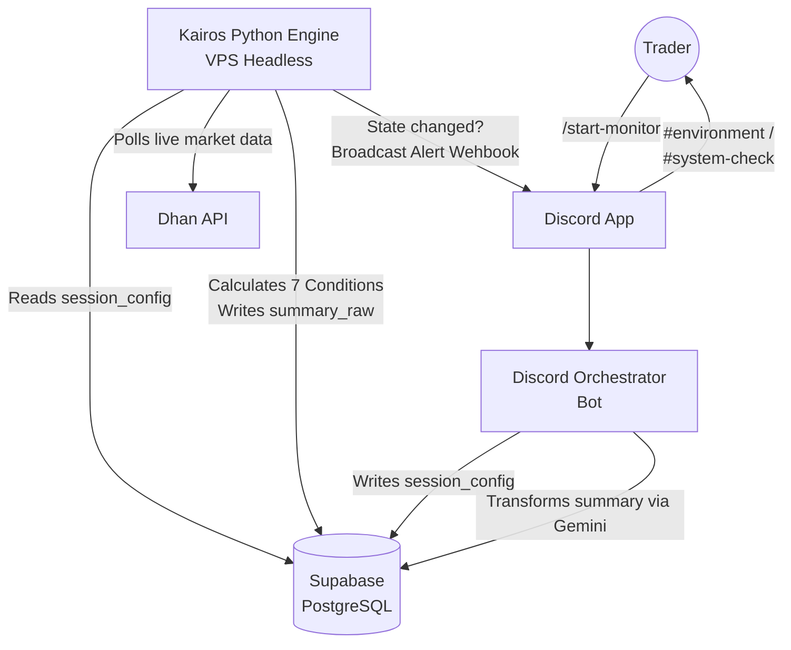

# Kairos: Scalping Environment Monitor

An intraday condition scoring engine designed specifically for **NIFTY Options Buying**. 

It does **not** generate trade signals. Instead, it acts as a live weather report, aggregating complex market data (Momentum, IV Flow, Gammas, VWAP) into a simple broadcast alert: **🟢 GO**, **🟡 CAUTION**, or **🔴 AVOID**.

---

## 📊 Greeks-Aware Scoring Engine (Condition 3)

The core conviction engine (Condition 3: OI Flow) has been upgraded from a simple delta classifier to a professional-grade **Greeks-Aware Scoring Engine**. It now evaluates institutional positioning using:

- **GEX (Gamma Exposure)**: Identifies dealer pins vs trending environments.
- **NDE (Net Delta Exposure)**: Confirms price momentum against chain delta bias.
- **Vega Trap Detection**: Protects buyers from entering "expensive" premiums during IV contraction.
- **Theta Burn Rate**: Detects rangebound "premiums sinks" dominated by option writers.

### Market Trend Phases
While the underlying **Trend Phase** (Price Δ vs OI Δ) is still calculated, it is now cross-verified against the Greeks above. Points are only awarded if ALL rules align.

| Phase | Price Δ | OI Δ | Interpretation |
|---|---|---|---|
| **Long Buildup 🟢** | Positive | Positive | Fresh buying; strong bullish conviction. |
| **Short Covering 🔵** | Positive | Negative | Sellers exiting; rally/pullback (Not Traded). |
| **Short Buildup 🔴** | Negative | Positive | Fresh selling; strong bearish conviction. |
| **Long Unwinding 🟠**| Negative | Negative | Buyers exiting; profit booking (Not Traded). |
| **Neutral 🟡** | Varied | < Thresh | Consolidation or writer-dominated market. |

---

## 🏗 System Architecture

The trading environment is entirely orchestrated through Discord via the Discord orchestrator bot. The Python Engine (this repository) runs headlessly on a VPS and communicates exclusively through an asynchronous **Supabase Shared State Bridge**.



---

## 📚 Advanced Documentation

If you are expanding this repository or integrating the orchestrator, please review the core documentation files before modifying logic:

- **[Discord Bot Integration Guide](docs/integration.md):** Exact responsibilities and database map for the Discord Bot side.
- **[Mathematical Scoring Architecture](docs/scoring_architecture.md):** The absolute source-of-truth for the 7 scoring condition parameters, lookback windows, and IV Cap logic.
- **[Architecture Decision Records (ADRs)](directives/adr/INDEX.md):** The historical log of system design choices, including why Supabase was chosen over WebSockets.
- **[Changelog](CHANGELOG.md):** Build milestones and test suite updates.

---

## 🛠 Developer Setup

If you are running the Kairos engine locally for development or testing:

### 1. Installation
This repository uses `pyproject.toml` standards. Ensure you have Python 3.11+ installed.
```bash
python -m venv .venv
source .venv/bin/activate
pip install -e ".[dev]"
```

### 2. Environment Variables
Copy the `.env.example` to `.env` and fill out your local secrets. 
**Note:** `.env` is explicitly ignored by `git`. Never commit your keys to version control. Dhan API credentials (`client_id` and `access_token`) are retrieved dynamically from the Supabase `api_keys` table rather than local environment variables.

| Variable | Description |
|---|---|
| `SUPABASE_URL` | Your Supabase project URL (`https://xyz.supabase.co`). |
| `SUPABASE_KEY` | Public `anon` API key for Supabase restricted via RLS. |
| `DISCORD_WEBHOOK_URL` | Webhook URL for the `#environment` channel. |
| `DISCORD_HEALTH_WEBHOOK_URL`| Webhook URL for the `#system-check` channel. |
| `OI_LOOKBACK_CYCLES` | (Optional) Num cycles for OI delta calculation (default: 5). |

### 3. Running the Test Suite
The codebase includes an exhaustive `pytest` suite ensuring all mathematical thresholds map to the correct 🟢/🟡/🔴 point system.
```bash
python -m pytest tests/ -v
```

### 4. Running the Engine
```bash
python -m kairos.scheduler
```
*(Ensure a valid session is marked as `ACTIVE` inside your Supabase `session_config` table, otherwise the engine will gracefully idle.)*

### 5. Fly.io Deployment
The engine can be easily deployed to [Fly.io](https://fly.io) using the included `Dockerfile`.

1. Install the Fly CLI (`flyctl`).
2. Run the launch command from the project root. If `fly` is not found, use `flyctl`:
   ```bash
   flyctl launch
   ```
3. Set your environment variables (secrets) securely. **Never copy the `.env` file directly.**
   ```bash
   cat .env | flyctl secrets import
   ```
4. **CRITICAL STEP - Remove HTTP Proxy:** Open your newly generated `fly.toml`. You MUST manually delete the entire `[http_service]` or `[[services]]` block. 
   > [!WARNING]
   > Fly.io automatically adds an `[http_service]` block with `auto_start_machines = true`. If you leave this in, random internet bots port-scanning your public IP will wake your machine up in the middle of the night! Kairos is a background worker, not a web server.
5. Deploy the application:
   ```bash
   flyctl deploy
   ```

**Note on Cost Optimization (Scale-to-Zero):**
To ensure the bot only runs during market hours (to save Fly.io compute credits), the machine is scheduled to start via **cron-job.org** calling the Fly.io Machines API.

1. **Generate a Fly Deploy Token** by running:
   ```bash
   flyctl tokens create deploy -x 99999h
   ```
2. **Configure Cron-job.org:**
   - Create a new cron job.
   - **Title:** `Start Kairos Fly Machine`
   - **Address (URL):** `https://api.machines.dev/v1/apps/kairos-yxfydw/machines/7847455a5e5d78/start`
   - **Execution Schedule:** Mon-Fri at **09:14 AM IST** (Asia/Kolkata timezone).
   - **Request Method (Advanced tab):** `POST`
   - **HTTP Headers:** Add `Authorization` header with the value `Bearer <YOUR_FLY_TOKEN>`.
3. **Automatic Stop & Scale-to-Zero:**
   - The application automatically exits via `sys.exit(0)` at market close (`15:25 IST`).
   - Since `fly.toml` does not contain an `[http_service]` block, Fly.io detects the process exit and scales the machine down to `stopped` state automatically, requiring no "stop" cron job.

### 6. Direct CLI Control (Bypass Discord)
For development or manual testing, you can control the monitoring session directly from the terminal without using the Discord Bot.
```bash
# Start monitoring NIFTY for a specific expiry
python execution/control_panel.py start NIFTY 2026-04-16 --type WEEKLY

# Stop the active session
python execution/control_panel.py stop
```
